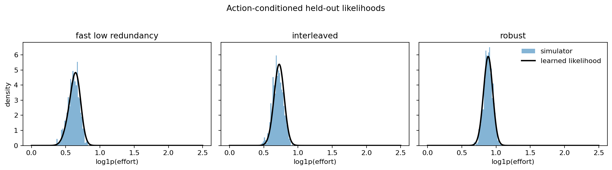
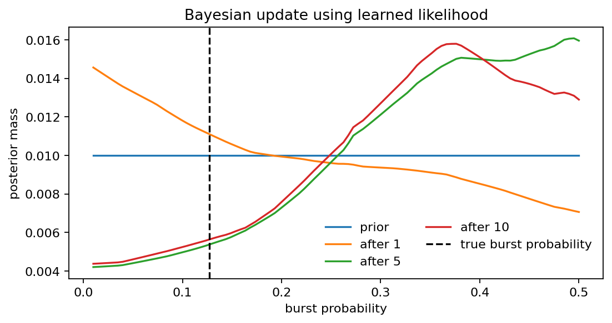
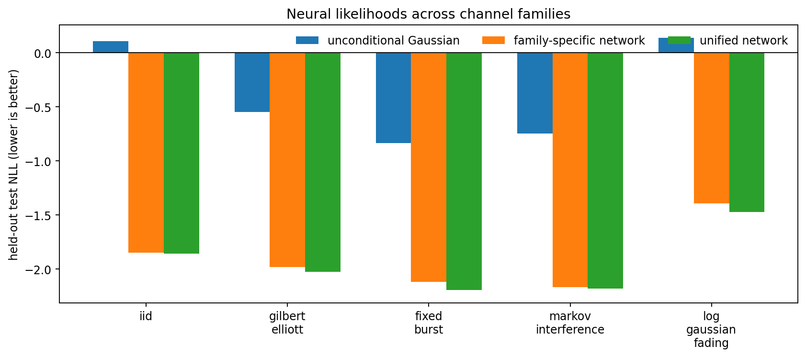

# Wireless Neural Likelihoods

Simulation-based action-conditioned neural likelihoods for adaptive communication systems.

This repository demonstrates a lightweight but complete statistical pipeline. Given channel/interference state \(\theta\) and a structured communication action \(a\), a simulator produces stochastic receiver telemetry \(m\). A neural conditional density model learns \(q_\phi(m\mid\theta,a)\), which is then used in Bayesian channel-state inference.

\[
(\theta,a) \rightarrow \text{simulation} \rightarrow m \rightarrow q_\phi(m\mid\theta,a) \rightarrow \text{Bayesian update}.
\]

## Quick start

```bash
pip install -e ".[dev]"
python examples/quick_demo.py
```

The CPU-only demo generates a repeated-simulation dataset, trains a conditional Gaussian likelihood, and writes:

- `results/likelihood_fit.png` — held-out effort distributions and learned action-conditioned densities.
- `results/posterior_update.png` — a sequential posterior over fixed-burst probability.





For the larger default dataset:

```bash
python scripts/generate_dataset.py
python scripts/train_likelihood.py
python scripts/plot_likelihood.py
python scripts/bayes_demo.py
pytest
```

## Multi-channel benchmark

Train one three-component mixture network per channel family and compare them with a single unified network:

```bash
python scripts/train_all_channels.py
```

The unified network receives a channel-family one-hot vector, a four-slot parameter vector, and the four action features. The default benchmark uses 48 held-out-grouped states per family, three actions, and 20 stochastic replicates: 2,880 samples per family and 14,400 total. Family-specific models have about 5,500–5,700 parameters; the unified model has 12,111.

| Channel family | Unconditional baseline | Family-specific network | Unified network |
|---|---:|---:|---:|
| IID | 0.106 | -1.847 | **-1.859** |
| Gilbert–Elliott | -0.546 | -1.982 | **-2.025** |
| Fixed burst | -0.836 | -2.120 | **-2.195** |
| Markov interference | -0.748 | -2.166 | **-2.178** |
| Log-Gaussian fading | 0.140 | -1.394 | **-1.474** |

Values are held-out test NLL; lower is better. Exact metrics and configuration are saved under `results/channel_benchmark/`.



## What is modeled

The package contains analytical, reproducible simulators for IID errors, Gilbert-Elliott good/bad channels, fixed bursts, ON/OFF Markov interference, and log-Gaussian fading with a squared-exponential (RBF) temporal-correlation kernel.

Three actions represent generic configurations with different redundancy, interleaving, decoder strength, and decoder budget. They are deliberately structured feature vectors rather than integer labels, so real coding/decoder settings can replace them later without changing the likelihood API.

The initial trained baseline uses one channel family per dataset, preserving a well-defined theta vector. It includes a diagonal Gaussian and a three-component Gaussian-mixture density network; the quick demo selects the mixture model because burst events can be multimodal. Both model continuous receiver telemetry:

\[
m=[\text{reliability}, \log(1+\text{effort})].
\]

The binary success flag is retained in the dataset for a later mixed discrete/continuous likelihood.

## Public interface

```python
sample = simulate_once(channel_model, channel_state, action, rng)
log_likelihood = model.log_prob(measurement, theta, action.features())
posterior = bayesian_update(model, theta_grid, action, measurement)
```

All data splits occur by exact channel state, not by individual simulated row. This means validation and test sets contain unseen \(\theta\) points rather than leaked stochastic replicates.

> **Current scope.** The initial release uses lightweight analytical and synthetic channel models together with an abstract receiver telemetry model. The receiver interface is deliberately decoder-agnostic: it is intended to support future integrations with conventional FEC decoders and higher-fidelity communications simulators without changing the likelihood-learning interface.

## Layout

```text
src/wireless_likelihoods/  package interfaces, simulators, receiver, learning, inference
scripts/                  reproducible dataset/training/plot commands
examples/quick_demo.py    compact full vertical slice
tests/                    statistical, reproducibility, likelihood, and inference tests
results/                  generated figures and checkpoints
```

## Roadmap

### v0.1 — lightweight synthetic environments

Analytical channels, abstract telemetry, action-conditioned Gaussian likelihoods, figures, and grid posterior updates.

### v0.2 — richer likelihoods

Gaussian mixtures, mixed discrete/continuous observations, calibration diagnostics, and posterior predictive checks.

### v0.3 — communications backends

Real coding families, conventional FEC backends, and waveform-level AWGN/fading models.

### v0.4 — high-fidelity environments

Sionna adapters, measured channel data, multi-interferer environments, standardized channel models, and ray-traced environments.

## Contributing

See [CONTRIBUTING.md](CONTRIBUTING.md). Keep core interfaces lightweight and preserve the separation between simulator/receiver backends and likelihood/inference code.
